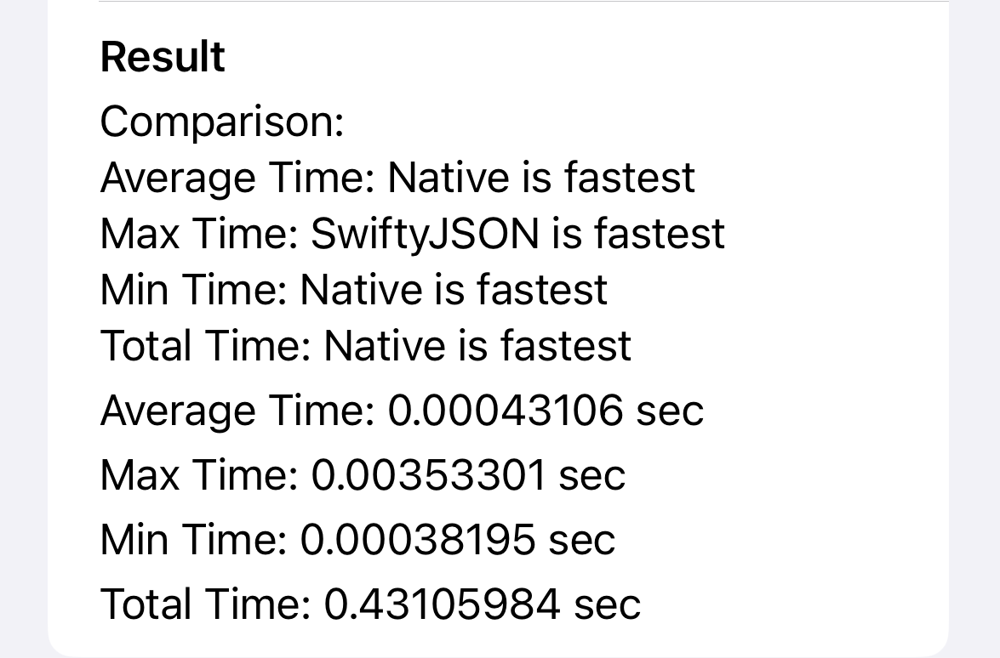
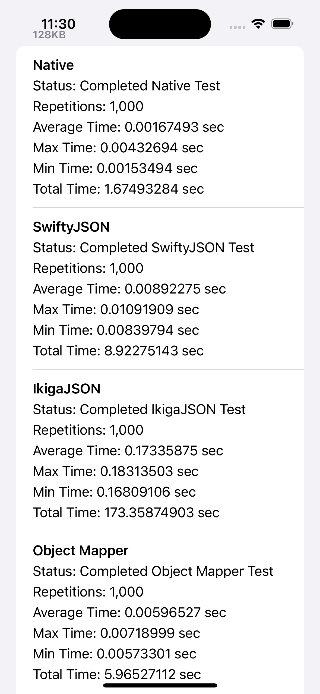
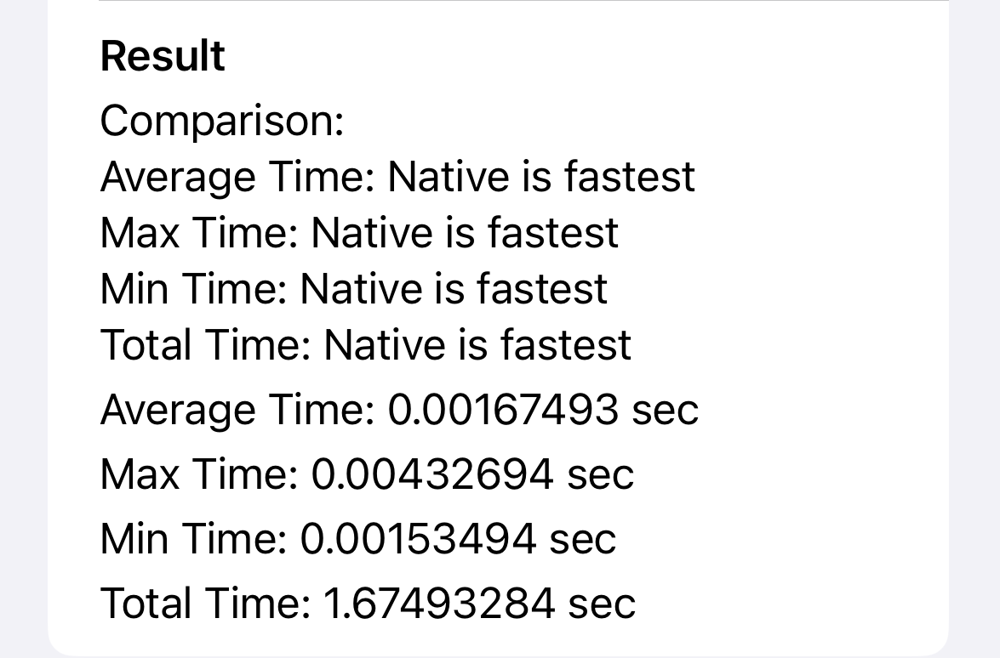
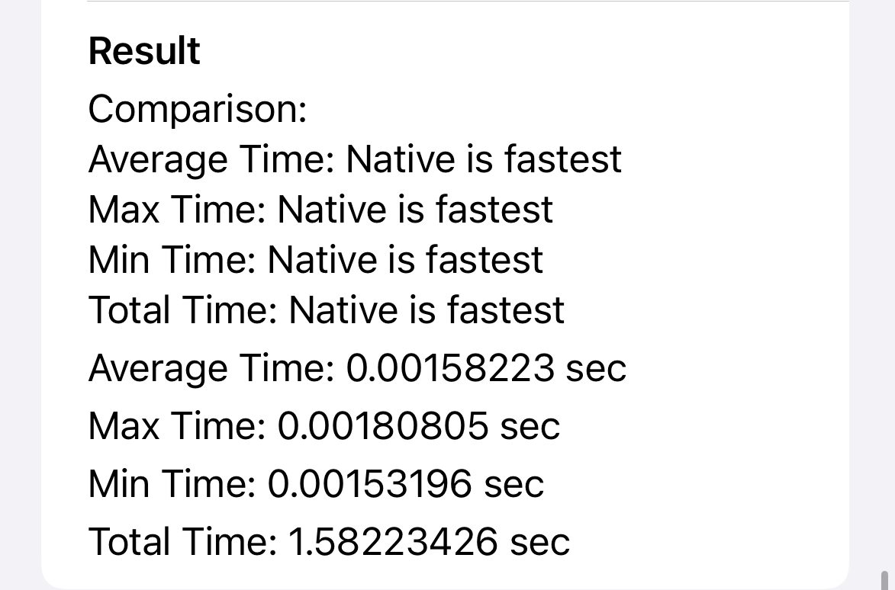
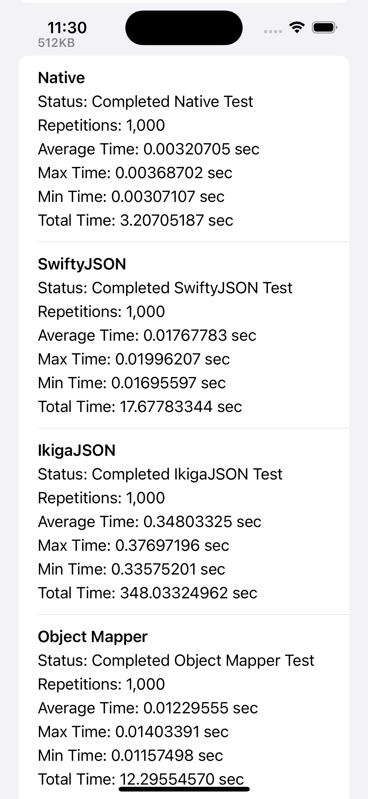
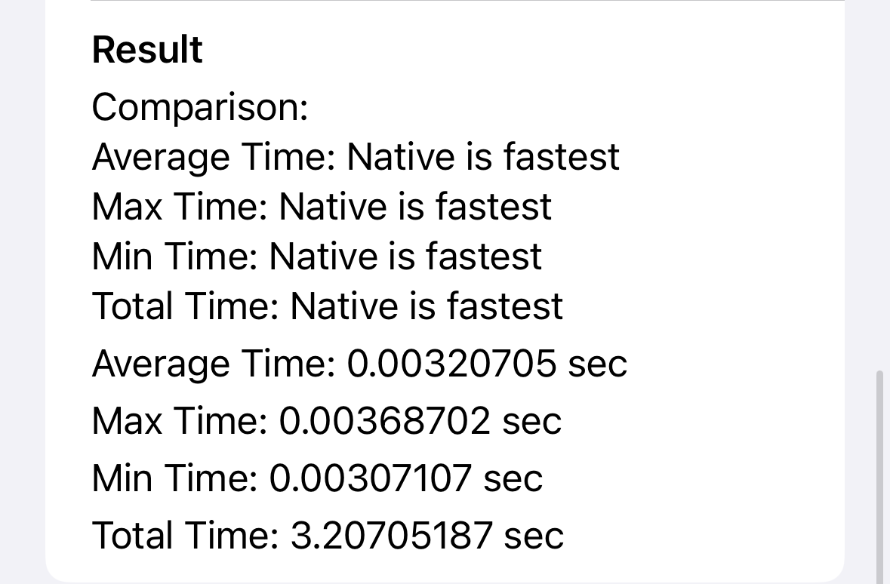
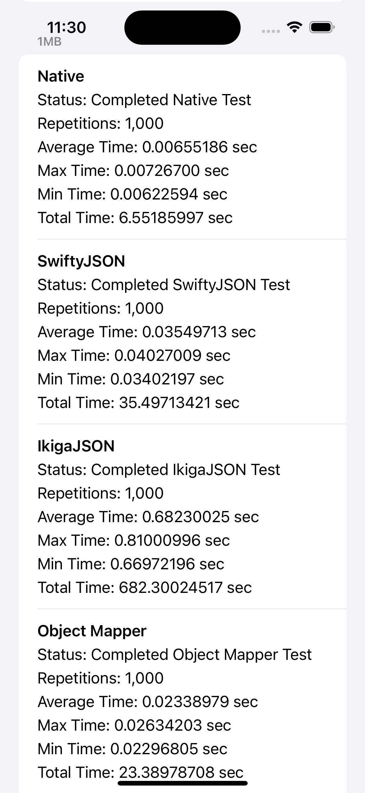
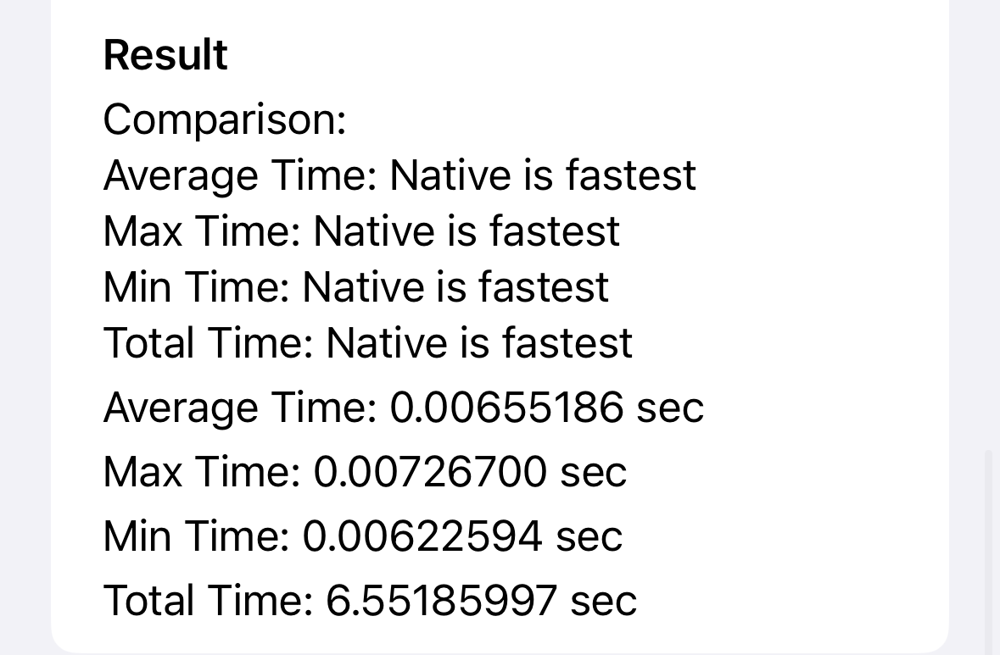
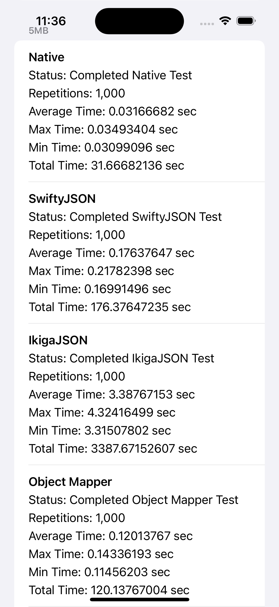
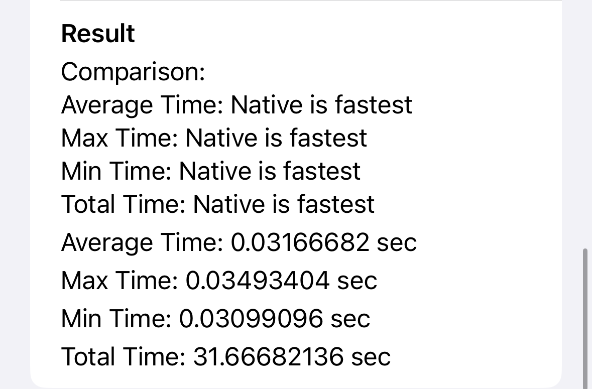

# JSON Benchmarking iOS
This project is a simple iOS app that benchmarks the performance of JSON serialization and object mapping libraries. The libraries that are currently being tested are:

- [Apple Native](https://developer.apple.com/documentation/foundation/jsondecoder)
- [SwiftyJSON](https://github.com/SwiftyJSON/SwiftyJSON)
- [IkigaJSON](https://github.com/orlandos-nl/IkigaJSON)
- [ObjectMapper](https://github.com/tristanhimmelman/ObjectMapper)

The app has 6 different test cases that are run for each library. The test cases are:

- 64 KB JSON file
- 128 KB JSON file
- 256 KB JSON file
- 512 KB JSON file
- 1 MB JSON file
- 5 MB JSON file

The app will run each test case 10_000 times and calculate the average time it took to complete the test case. The results are displayed in a list view.

## Results

The results are displayed in a list view. The results are displayed in seconds.

### 64 KB JSON file

| Library Performance | Results|
| -- | -- |
|  |  |

| Library | Average Time | Max Time | Min Time | Total Time |
| - | - | - | - | - |
| Apple Native | 0.00043106 | 0.00791097 | 0.00038195 | 0.43105984 |
| SwiftyJSON | 0.00216247 | 0.00353301 | 0.00209701 | 2.16246557 |
| IkigaJSON | 0.04264846 | 0.05199504 | 0.04156804 | 42.64846253 |
| ObjectMapper | 0.00156200 | 0.00354600 | 0.00143600 | 1.56199861 |

Comparing the results of the 64 KB JSON file, the Apple Native library is the fastest, followed by ObjectMapper, SwiftyJSON, and IkigaJSON.

### 128 KB JSON file

| Library Performance | Results|
| -- | -- |
|  |  |

| Library | Average Time | Max Time | Min Time | Total Time |
| - | - | - | - | - |
| Apple Native | 0.00167493 | 0.00432694 | 0.00153494 | 1.67493284 |
| SwiftyJSON | 0.00892275 | 0.01091909 | 0.00839794 | 8.92275143 |
| IkigaJSON | 0.1733587 | 0.18313503 | 0.16809106 | 173.35874903 |
| ObjectMapper | 0.00596527 | 0.00718999 | 0.005733301 | 5.965227112 |

Comparing the results of the 128 KB JSON file, the Apple Native library is the fastest, followed by ObjectMapper, SwiftyJSON, and IkigaJSON.

### 256 KB JSON file

| Library Performance | Results|
| -- | -- |
|  |  |

| Library | Average Time | Max Time | Min Time | Total Time |
| - | - | - | - | - |
| Apple Native | 0.00158223 | 0.00180805 | 0.00153196 | 1.58223426 |
| SwiftyJSON | 0.00887678 | 0.01022100 | 0.00841498 | 8.87678146 |
| IkigaJSON | 0.17404360 | 0.18604004 | 0.16864502 | 174.04359865 |
| ObjectMapper | 0.00602423 | 0.00658202 | 0.00573099 | 6.02423418 |

Comparing the results of the 256 KB JSON file, the Apple Native library is the fastest, followed by ObjectMapper, SwiftyJSON, and IkigaJSON.

### 512 KB JSON file

| Library Performance | Results|
| -- | -- |
|  |  |

| Library | Average Time | Max Time | Min Time | Total Time |
| - | - | - | - | - |
| Apple Native | 0.00320705 | 0.00368702 | 0.00307107 | 3.20705187 |
| SwiftyJSON | 0.01767783 | 0.01996207 | 0.01695597 | 17.67783344 |
| IkigaJSON | 0.34803325 | 0.37697196 | 0.33575201 | 348.03324962 |
| ObjectMapper | 0.01229555 | 0.01403391 | 0.01157498 | 12.29554570 |

Comparing the results of the 512 KB JSON file, the Apple Native library is the fastest, followed by ObjectMapper, SwiftyJSON, and IkigaJSON.

### 1 MB JSON file

| Library Performance | Results|
| -- | -- |
|  |  |

| Library | Average Time | Max Time | Min Time | Total Time |
| - | - | - | - | - |
| Apple Native | 0.00655186 | 0.00726700 | 0.00622594 | 6.55185997 |
| SwiftyJSON | 0.03549713 | 0.04027009 | 0.03402197 | 35.49713421 |
| IkigaJSON | 0.68230025 | 0.81000996 | 0.66972196 | 682.30024517 |
| ObjectMapper | 0.02338979 | 0.02634203 | 0.02296805 | 23.38978708 |

Comparing the results of the 1 MB JSON file, the Apple Native library is the fastest, followed by ObjectMapper, SwiftyJSON, and IkigaJSON.

### 5 MB JSON file

| Library Performance | Results|
| -- | -- |
|  |  |

| Library | Average Time | Max Time | Min Time | Total Time |
| - | - | - | - | - |
| Apple Native | 0.03166682 | 0.03493404 | 0.03099096 | 31.66682136 |
| SwiftyJSON | 0.17637647 | 0.21782398 | 0.16991496 | 176.37647235 |
| IkigaJSON | 3.38767153 | 4.32416499 | 3.31507802 | 3387.67152607 |
| ObjectMapper | 0.12013767 | 0.14336193 | 0.11456203 | 120.13767004 |

Comparing the results of the 5 MB JSON file, the Apple Native library is the fastest, followed by ObjectMapper, SwiftyJSON, and IkigaJSON.

## Conclusion

The Apple Native library is the fastest library for JSON serialization and object mapping. The ObjectMapper library is the second fastest, followed by SwiftyJSON and IkigaJSON. 

For small JSON files, the performance difference between the libraries is not significant. However, for larger JSON files, the performance difference becomes more noticeable. The Apple Native library consistently outperforms the other libraries in all test cases.

## License

This project is licensed under the MIT License - see the [LICENSE.md](LICENSE.md) file for details.
